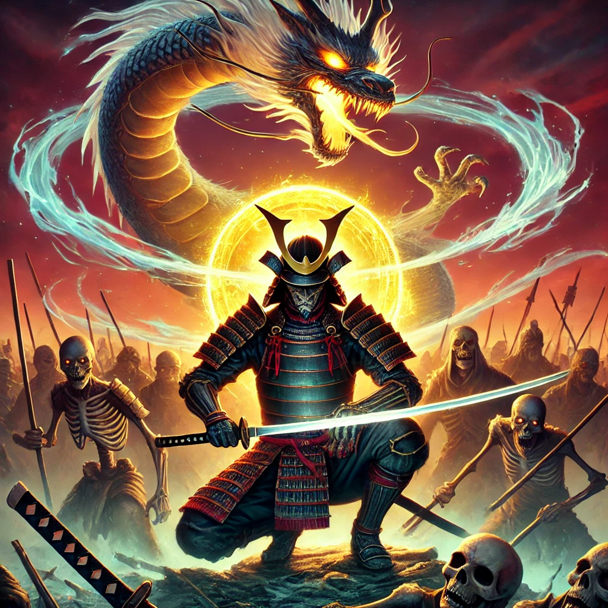

# 🐉 Dragon Samurai

A thrilling action platformer game where you play as Onimusha, a brave samurai fighting through an army of the undead to claim the legendary dragon's treasure.

## 🎮 Game Overview

Dragon Samurai is built using Phaser 3, offering an engaging combat system, fluid animations, and challenging gameplay. Battle against different types of skeleton warriors while collecting treasures and advancing through levels.

## 🚀 Features

- Fluid samurai combat mechanics
- Multiple enemy types (warriors, spearmen, archers)
- Score system and collectibles
- Dynamic platforming
- Responsive controls
- Beautiful Japanese-themed graphics

## 🛠️ Prerequisites

- Node.js (v14.0.0 or higher)
- npm (v6.0.0 or higher)

## 📥 Installation

1. Clone the repository:
```bash
git clone https://github.com/yourusername/dragon-samurai.git
cd dragon-samurai
```

2. Install dependencies:
```bash
npm install
```

3. Start the development server:
```bash
npm start
```

4. Open your browser and navigate to:
http://localhost:3000


## 🎮 Controls

- **←→** : Move left/right
- **↑** : Jump
- **Z** : Quick Attack
- Additional controls are displayed in the game's menu

## 🏗️ Project Structure
dragon-samurai/
├── assets/
│ ├── images/
│ └── objects/
├── src/
│ ├── scenes/
│ ├── managers/
│ └── config/
├── index.html
├── server.js
└── package.json


## 🚀 Deployment

The game can be deployed to various platforms. For Vercel deployment:

1. Push your code to GitHub
2. Connect your repository to Vercel
3. Configure the build settings:
   - Build Command: `npm install`
   - Output Directory: `.`
   - Install Command: `npm install`

## 🔧 Configuration

Game settings can be modified in `src/config/gameConfig.js`, including:
- Player attributes
- Enemy behavior
- Platform settings
- Scoring system

## 🤝 Contributing

Contributions are welcome! Please feel free to submit a Pull Request.

## 📝 License

This project is licensed under the ISC License - see the LICENSE file for details.

## 🙏 Acknowledgments

- Phaser.js game framework
- Art assets (include attribution if necessary)
- Community contributors

## 📞 Contact

For questions or support, please open an issue in the GitHub repository.

---
Made with ❤️ by Matias Kamelman
